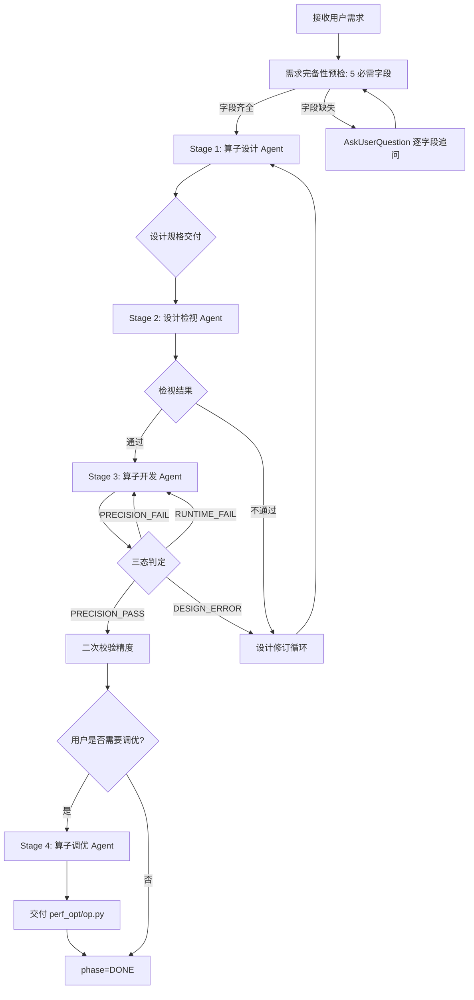

# TileLang-NPUIR 算子自动生成系统

基于 OpenCode Agent 编排的 TileLang-NPUIR 算子端到端自动开发系统。通过 **Stage-Gate（阶段门禁）** 模式调度四个专职子 Agent，将算子从一句自然语言需求自动推进到经精度与性能验证的可交付 kernel。

本目录（`.opencode/agents/`）存放编排 Agent 与四个阶段子 Agent 的定义；配套的领域能力沉淀在 `.agents/skills/` 下。

---

## 目录

- [适用场景](#适用场景)
- [系统架构](#系统架构)
- [端到端流程](#端到端流程)
- [使用方式](#使用方式)
- [产物与目录结构](#产物与目录结构)
- [状态机与失败处理](#状态机与失败处理)
- [Agent 一览](#agent-一览)
- [Skill 一览](#skill-一览)
- [相关文档](#相关文档)

---

## 适用场景

### 何时使用本系统

| 场景       | 说明                                                                         |
| ---------- | ---------------------------------------------------------------------------- |
| 新算子开发 | 从数学公式/参考 API 出发，自动设计 → 检视 → 实现 → 调优                   |
| 算子迁移   | 已有 TileLang（GPU/CPU）实现，迁移到`target="npuir"`，函数名与签名保持不变 |
| 中断后续跑 | 任务因环境/超时中断，从`.stage_state.json` 记录的阶段续跑                  |
| 失败恢复   | 精度/编译失败后，在原阶段内按失败子类型路由重试                              |
| 设计修订   | 检视不通过或实施期发现设计层错误，自动回退 Stage 1 重做设计                  |

### 覆盖的算子类型

| 类型                      | 典型算子                                          | 涉及 Skill                |
| ------------------------- | ------------------------------------------------- | ------------------------- |
| 纯 Vector                 | element-wise、激活、归约、softmax 子流程、rmsnorm | `tilelang-vector-skill` |
| 纯 Cube                   | matmul、batch gemm、int8 量化 gemm                | `tilelang-cube-skill`   |
| 混合 Cube+Vector（MixCV） | flash attention、online softmax + GEMM 融合       | `tilelang-mixcv-skill`  |

### 编程模式

系统支持三种编程模式，由用户在需求预检阶段显式选择（不可默认填）：

| 模式                | 特点                                            | 适用                   |
| ------------------- | ----------------------------------------------- | ---------------------- |
| **Developer** | 编译器托管行为，API 简洁，自动同步              | 快速开发、常规算子     |
| **Expert**    | 手动控制 L1/UB/L0C、NZ 格式、set_flag/wait_flag | 极致性能、Cube NZ 路径 |

模式切换：`os.environ["TILELANG_ASCEND_MODE"] = "Developer"` / `"Expert"`

---

## 系统架构

### 编排模型

```
┌─────────────────────────────────────────────────────────┐
│            tilelang-op-conductor (Primary)              │
│   唯一流程 owner：状态机、门禁、修订循环、用户交互        │
│   不做任何算子领域推理，只调度 Subagent + 维护状态        │
└────────────┬───────────────┬───────────────┬───────────┘
             │               │               │
     ┌───────▼──────┐ ┌──────▼──────┐ ┌──────▼──────┐ ┌─────────────┐
     │ Stage 1      │ │ Stage 2     │ │ Stage 3     │ │ Stage 4     │
     │ op-designer  │ │ design-     │ │ op-         │ │ op-         │
     │ (Subagent)   │ │ reviewer    │ │ developer   │ │ optimizer   │
     │              │ │ (Subagent)  │ │ (Subagent)  │ │ (Subagent)  │
     │ → DESIGN.md  │ │ → REVIEW.md │ │ → {op}.py   │ │ → perf_opt/ │
     └──────────────┘ └─────────────┘ └─────────────┘ └─────────────┘
            │               │  skill:      │  skill:        │  skill:
            │  skill:       │  tilelang-   │  tilelang-     │  tilelang-
            │  tilelang-    │  design-     │  op-develop    │  op-optimize
            │  op-design    │  review      │                │
```

### 核心设计原则

1. **只以工件和状态推进流程**——依据算子目录中的工件与 `.stage_state.json`，不凭对话历史假设阶段完成。
2. **逐阶段推进，不跳阶段**——每个 Stage 必须通过门禁校验才能进入下一阶段。
3. **状态由 conductor 独占维护**——`retry_count`、`phase` 迁移、`stage_retry_count` 只由 conductor 读写；Subagent 一律禁止读写状态文件。
4. **所有阶段都通过 Subagent 执行**——conductor 只编排决策，不亲自生成工件，**绝对禁止自行修复代码**。
5. **design.md 不是硬性约束**——API 误判、tiling 不可行、内存层级错误时走设计修订流程，不在原阶段强行重试。
6. **所有结论必须可验证**——每个阶段有最小可验证工件或命令输出，未验证项如实披露。

---

## 端到端流程

### 四阶段总览

| Stage      | phase       | 子 Agent                      | 交付件               | 完成信号              |
| ---------- | ----------- | ----------------------------- | -------------------- | --------------------- |
| 1 算子设计 | `DESIGN`  | `@tilelang-op-designer`     | `DESIGN.md`        | `DESIGN_COMPLETED`  |
| 2 设计检视 | `REVIEW`  | `@tilelang-design-reviewer` | `REVIEW.md`        | `REVIEW_COMPLETED`  |
| 3 算子开发 | `DEVELOP` | `@tilelang-op-developer`    | `{op}.py`          | `DEVELOP_COMPLETED` |
| 4 算子调优 | `TUNING`  | `@tilelang-op-optimizer`    | `perf_opt/{op}.py` | `TUNING_COMPLETED`  |

### 流程图



### 各阶段详情

#### Stage 1 — 算子设计（`tilelang-op-designer`）

- **输入**：conductor 在 Primary 上下文预检后传入的 `op_requirements` 结构（算子名、公式、I/O 规格、编程模式）。
- **执行**：调用 `tilelang-op-design` skill → 技术约束检测（三维 Kernel、GPU 专用 API、GEMM 非整除、L0C 溢出）→ 检索 `examples/` 同类实现 → 生成 `DESIGN.md`。
- **DESIGN.md 必含章节**：概述、编程模式选型、API 映射、数据规格与内存规划、Tiling 策略（含非整除处理）、循环与调度结构、同步策略、CV 融合设计、验证方案（含 L0 门槛测试计划）、风险点、交付清单。
- **门禁**：13 项校验（文件存在、章节齐全、无占位符等），revision 模式额外校验"关键调整说明"。

#### Stage 2 — 设计检视（`tilelang-design-reviewer`）

- **输入**：`design_md_path`。
- **执行**：调用 `tilelang-design-review` skill → 7 维度风险优先检视。
- **7 维度**：API 可行性（阻塞）、内存层级规划（阻塞）、Tiling 策略（阻塞）、技术约束检测（阻塞）、循环与同步（建议）、验证方案（阻塞）、完整性与一致性（建议）。
- **结论**：字面量 `结论: 通过` 或 `结论: 不通过`；不通过时每个阻塞级问题必须给出可执行修改建议。
- **门禁**：结论行存在、结论与详情一致、7 维度完整、不通过时建议完整、无占位符。

#### Stage 3 — 算子开发（`tilelang-op-developer`）

- **输入**：冻结的 `DESIGN.md` + 通过的 `REVIEW.md` + `mode`（`first_impl` / `retry_impl` / `precision_fix`）。
- **执行**：调用 `tilelang-op-develop` skill → 生成 `@tilelang.jit(target="npuir")` kernel + 内嵌 PyTorch golden + 分层测试套件（L0/L1/L2/Boundary）→ 在 NPU 上真实跑测。
- **分层测试**：每次 attempt 先跑 L0 收敛精度 → L0 通过后扩展 L1/L2/Boundary 跑全量 `--level all`。L0/L1 失败才算精度未达标；L2/Boundary 告警仅记录不阻塞。
- **三态判定**：
  | 条件                                                             | 返回标记             | 路由                      |
  | ---------------------------------------------------------------- | -------------------- | ------------------------- |
  | L0 + L1 全过（L2/Boundary 告警不阻塞）                           | `[PRECISION_PASS]` | → 二次校验 → 询问调优   |
  | L0 或 L1 未过                                                    | `[PRECISION_FAIL]` | →`precision_fix` 重试  |
  | 设计层错误（API 不可用/L0C 溢出/内存层级冲突/同步冲突/动态边界） | `[DESIGN_ERROR]`   | → 设计修订循环（路径 B） |
  | 无标记且 exit code ≠ 0                                          | `RUNTIME_FAIL`     | →`retry_impl` 重试     |
- **重试上限**：5 次 attempt（运行失败 + 精度失败合并累计；`[DESIGN_ERROR]` 不计入）。

#### Stage 4 — 算子调优（`tilelang-op-optimizer`）

- **进入条件**：Stage 3 `[PRECISION_PASS]` 且二次校验通过后，**conductor 必须主动询问用户**是否需要调优。
- **输入**：`kernel_py_path`、`design_md_path`、性能目标信息（类型/目标数值/测试 shape/噪声阈值/最大迭代数）。
- **执行**：调用 `tilelang-op-optimize` skill → 基线分析（NPU 上 `msprof op` 真实 profiling）→ 每轮迭代（选策略 → 生成优化版 → 精度回归跑 L0 → 性能测量 → 记日志）。
- **优化策略**：调整 block size、增加 T.Pipelined 流水深度、double-buffer、v-prefix API 替换、减少中间 buffer、data reuse。
- **中止条件**（满足任一）：迭代达上限（默认 10）/ 连续三次无提升 / 达到用户指定性能目标。
- **调优不逆向反馈**：性能不足时由 optimizer 自完成最优版本，不回退到 Stage 3/1。

### 设计修订机制

两条触发路径，**共用同一个 `retry_count` 预算**（上限 `max_retry`，默认 3）：

| 路径              | 触发源               | 识别信号                             |
| ----------------- | -------------------- | ------------------------------------ |
| A. 检视不通过     | Stage 2`REVIEW.md` | `结论: 不通过` + 修改建议          |
| B. 实施期设计错误 | Stage 3 Subagent     | 输出含`[DESIGN_ERROR]` 标记 + 原因 |

处理流程：备份旧 `DESIGN.md` → `history_version/design_v{N}.md` → `retry_count += 1` → 若未超限则重做 Stage 1（`mode=revision`，传入 `design_error_summary` + `previous_revisions` 避免重蹈覆辙）→ 超 `max_retry` 则 `phase=FAILED`、`failure_reason=BLOCKED_DESIGN`。

---

## 使用方式

### 前置环境

1. **NPU 设备**：算子编译与执行在昇腾 NPU 上真实进行，`tilelang` 与 `torch_npu` 可正常导入。
2. **环境初始化**：`source set_env.sh`（CANN 环境变量）。
3. **OpenCode**：本系统依赖 OpenCode 的 Primary/Subagent 编排能力与 `AskUserQuestion` 工具。

### 启动一次算子开发

在 OpenCode 会话中向 conductor 发送需求即可。conductor 会自动执行需求预检、调度各阶段 Subagent、维护状态。

#### 示例 1：新算子开发

```
请帮我开发一个 softmax 算子，target=npuir。
数学公式：softmax(x_i) = exp(x_i - max) / sum(exp(x_j - max))
输入：[B, N] float16，B 动态、N 静态
输出：同输入
编程模式：Developer
```

#### 示例 2：迁移类任务

```
请把这个 TileLang GPU 算子迁移到 npuir：
文件：examples/gemm/matmul.py
输出 shape：(M, N)
```

#### 示例 3：续跑/恢复

```
继续开发 examples/norm/layer_norm/ 的算子
```

conductor 会读取 `examples/norm/layer_norm/.stage_state.json`，从记录的 `phase` 续跑。

### 需求预检的 5 个必需字段

conductor 在 Stage 1 启动前会在 Primary 上下文逐字段确认（缺失则通过 `AskUserQuestion` 追问，**编程模式不可默认填**）：

| 字段                | 判定齐全标准                                    |
| ------------------- | ----------------------------------------------- |
| 算子名称            | 用户消息含明确算子名（如`softmax`）           |
| 数学公式 / 计算语义 | 公式或标准 API 名（如"参考 PyTorch F.softmax"） |
| 输入张量规格        | shape + dtype 都明确（shape 可含动态维度符号）  |
| 输出张量规格        | shape + dtype 都明确（可答"同输入"）            |
| 编程模式偏好        | `Developer` / `Expert` / `混合` 三者之一  |

迁移类任务额外要求：提供原算子文件路径 + 输出 shape。

### 与 conductor 交互的注意事项

- **任何需要用户回答的字段由 conductor 在 Primary 上下文直接询问**——Subagent 的 `AskUserQuestion` 透传不到真实用户。
- Stage 3 精度通过后，conductor 会主动询问是否需要性能调优，回答"否"即直接 `phase=DONE`。
- 用户中途修改需求字段时，conductor 会重新触发预检确认。
- 多算子场景下每个算子使用独立的算子目录和独立状态文件。

---

## 产物与目录结构

### 标准目录

```text
examples/{project}/{op}/
├── DESIGN.md                     # Stage 1 产物
├── REVIEW.md                     # Stage 2 产物
├── {op}.py                       # Stage 3 产物（kernel + 内嵌 golden + 分层测试 + main）
├── README.md                     # Stage 3 产物（可选，实现说明）
├── perf_opt/                     # Stage 4 产物目录
│   ├── {op}.py                   #   最优版本
│   ├── {op}_opt_v{N}.py          #   各迭代版本
│   └── opt_log.md               #   调优日志
├── history_version/              # 设计修订备份 + Stage 3 精度调试备份
│   ├── design_v{N}.md
│   └── {op}_impl_s3_attempt{N}.py
└── .stage_state.json             # conductor 专属状态文件（仅 conductor 读写）
```

- `project_name` 决定项目目录 `examples/{project}/`（可含多个算子）；解析不出项目名时 `project = op`。
- `op_name` 决定算子目录 `examples/{project}/{op}/` 及文件名。
- Golden 函数直接内嵌在 `{op}.py`（PyTorch CPU 参考实现），不强制独立 `golden_{op}.py`。

### `{op}.py` 结构规范

```python
# 1. Copyright (c) Huawei Technologies Co., Ltd. 2026.
# 2. imports (tilelang or torch_npu)
# 3. golden_{op}(...) function          # PyTorch CPU 参考实现
# 4. @tilelang.jit kernel              # target="npuir"
# 5. run_case()                         # 精度对比
# 6. run_L0/run_L1/run_L2/run_boundary  # 分层测试
# 7. main()                             # --level L0 / --level all
```

### 最终输出报告

流程结束时 conductor 输出结构化摘要：

```markdown
## 开发结果
- project: {project}  算子: {op}  phase: DONE / FAILED  failure_reason: <FAILED 时>
- design: examples/{project}/{op}/DESIGN.md
- review: examples/{project}/{op}/REVIEW.md
- kernel: examples/{project}/{op}/{op}.py
- final_artifact: <perf_opt/{op}.py 或 {op}.py>

## 精度结果
- status: PASS / FAIL  accuracy_fix_count: {N}

## 性能结果（若进入 Stage 4）
- iterations: {N}  improvement: {x}%
- final_artifact: perf_opt/{op}.py
```

---

## 状态机与失败处理

### 状态机

```
INIT --> DESIGN --> REVIEW --> DEVELOP --> TUNING --> DONE
  ^                 |
  |___ 修订循环 ____|  (retry_count < max_retry)
  |___ 超限 _______> FAILED
```

### `.stage_state.json` 关键字段

| 字段                                 | 说明                                                                                      |
| ------------------------------------ | ----------------------------------------------------------------------------------------- |
| `phase`                            | `DESIGN / REVIEW / DEVELOP / TUNING / DONE / FAILED`                                    |
| `project_name` / `operator_name` | 决定全流程目录路径                                                                        |
| `retry_count` / `max_retry`      | 设计修订预算（路径 A+B 合并累计，默认上限 3）                                             |
| `stage_retry_count`                | 各阶段子 Agent 异常重试计数（独立于`retry_count`）                                      |
| `stage3_failure_breakdown`         | `runtime_fail` / `precision_fail` 细分                                                |
| `failure_reason`                   | `BLOCKED_DESIGN / BLOCKED_IMPL / BLOCKED_ACCURACY / BLOCKED_ENVIRONMENT / BLOCKED_SPEC` |

### 重试与中止规则

| Stage    | 上限                                                   | 超限后状态                                                    |
| -------- | ------------------------------------------------------ | ------------------------------------------------------------- |
| 1        | 3 次门禁失败                                           | `BLOCKED_DESIGN`                                            |
| 2        | 检视不通过走`retry_count` 修订循环                   | `retry_count >= max_retry` → `BLOCKED_DESIGN`            |
| 3        | 5 次 Subagent 调度（运行+精度合并；DESIGN_ERROR 不计） | 运行失败 →`BLOCKED_IMPL`；精度失败 → `BLOCKED_ACCURACY` |
| 4        | 10 轮迭代                                              | `SUCCESS`（附中止原因）                                     |
| 设计修订 | `max_retry`（默认 3）                                | `BLOCKED_DESIGN`                                            |

---

## Agent 一览

本目录下的 Agent 定义文件：

| 文件                            | Agent                        | 角色                                               | mode     |
| ------------------------------- | ---------------------------- | -------------------------------------------------- | -------- |
| `tilelang-op-conductor.md`    | `tilelang-op-conductor`    | 唯一流程 owner，调度四阶段、维护状态、处理修订循环 | primary  |
| `tilelang-op-designer.md`     | `tilelang-op-designer`     | Stage 1 执行器，生成`DESIGN.md`                  | subagent |
| `tilelang-design-reviewer.md` | `tilelang-design-reviewer` | Stage 2 执行器，生成`REVIEW.md`                  | subagent |
| `tilelang-op-developer.md`    | `tilelang-op-developer`    | Stage 3 执行器，生成`{op}.py` + 三态判定         | subagent |
| `tilelang-op-optimizer.md`    | `tilelang-op-optimizer`    | Stage 4 执行器，生成`perf_opt/{op}.py`           | subagent |

### Agent 间职责边界

- **conductor**：状态机、门禁校验、修订决策、用户交互、失败路由——**不做算子领域推理，不编辑工件**。
- **designer**：只生成 `DESIGN.md`，不定义下游阶段。
- **design-reviewer**：只读检视 `DESIGN.md`，给出结论，**不修改 DESIGN.md**。
- **developer**：只生成 `{op}.py`，不修改上游工件，三态判定如实反映真实测试结果。
- **optimizer**：只写 `perf_opt/`，调优不逆向反馈到 Stage 3/1。

所有 Subagent 共同约束：不得调用其他 Subagent、不得读写状态文件、不得在 Subagent 上下文直接 `AskUserQuestion`。

---

## Skill 一览

领域能力沉淀在 `.agents/skills/`，Agent 通过 `skills:` 字段声明依赖：

### 算子开发流程类（Stage 直接调用）

| Skill                      | 触发                     | 产物                                  |
| -------------------------- | ------------------------ | ------------------------------------- |
| `tilelang-op-design`     | 设计算子、生成 DESIGN.md | `DESIGN.md`                         |
| `tilelang-design-review` | review 设计文档          | `REVIEW.md`                         |
| `tilelang-op-develop`    | 实现算子、跑精度         | `{op}.py` + 三态判定                |
| `tilelang-op-optimize`   | 性能调优                 | `perf_opt/{op}.py` + `opt_log.md` |

### 领域知识类（被上述流程或用户直接触发）

| Skill                       | 用途                                                             |
| --------------------------- | ---------------------------------------------------------------- |
| `tilelang-npuir-overview` | npuir 分支架构与编译链路、Developer/Expert 模式                  |
| `tilelang-vector-skill`   | Vector 算子开发，v-prefix API（vadd/vmul/vexp/vcast/vbrc）       |
| `tilelang-cube-skill`     | Cube 算子开发，load_nd2nz/store_fixpipe/NZ 格式/L1/L0C           |
| `tilelang-mixcv-skill`    | 混合 Cube+Vector，flash attention、流水并行、sync_block_set/wait |

### 辅助类

| Skill                          | 用途                                          |
| ------------------------------ | --------------------------------------------- |
| `tilelang-mlir-skill`        | TileLangIR / MLIR pass 工作流与调试           |
| `tilelang-debug-helper`      | GDB 附加、IR dump、精度异常定位、最小复现缩减 |
| `tilelang-error-fixer`       | 编译/运行/pass/精度/性能错误诊断与修复        |
| `tilelang-review-skill`      | 风险优先代码审查、PR 前 lint/format 校验      |
| `tilelang-github-operations` | commit/push/PR/rebase/issue 工作流            |

---

## 相关文档

### 项目内文档

| 文档            | 路径                                       | 内容                                                                 |
| --------------- | ------------------------------------------ | -------------------------------------------------------------------- |
| 仓库 Agent 指南 | `AGENTS.md`                              | API 约定、Skill 索引、触发规则、Docs 路由、算子实现基线、PR 格式规则 |
| 快速入门        | `docs/快速入门.md`                       | 工作流与上手                                                         |
| 开发指南        | `docs/开发指南.md`                       | 开发流程与规范                                                       |
| 调试指南        | `docs/Tilelang算子调试指南.md`           | 调试与问题定位                                                       |
| 贡献指南        | `docs/Tilelang-Ascend贡献指南.md`        | PR、issue、CI 流程                                                   |
| 环境变量        | `docs/developer/EnvironmentVariables.md` | 运行时与编译环境变量                                                 |
| NPU Runtime     | `docs/developer/npu runtime.md`          | target 切换、环境配置                                                |
| 模式对比        | `docs/Developer_Expert_Mode对比.md`      | Developer / Expert 差异                                              |
| 安装指南        | `docs/安装指南.md`                       | 环境安装                                                             |
| 语言 API 文档   | `docs/Tilelang.language/`                | 按 操作类型 分类的 API 语义文档                                      |

### Docs 自动路由规则

Skill 回答技术问题时按以下优先级路由文档（详见 `AGENTS.md`）：

1. `docs/Tilelang.language/` — API 语义与签名
2. `docs/Tilelang算子调试指南.md` — 调试与问题定位
3. `docs/developer/` — runtime 与环境变量
4. `docs/开发指南.md` / `docs/快速入门.md` — 工作流与上手
5. `docs/Tilelang-Ascend贡献指南.md` — PR 与贡献

### Skill 内部参考文档

| Skill                       | 参考文档                                                                                                                                                                                  |
| --------------------------- | ----------------------------------------------------------------------------------------------------------------------------------------------------------------------------------------- |
| `tilelang-op-design`      | `references/ascend-constraints.md`（技术约束）、`references/decision-tree.md`（决策树）、`references/info-sources.md`（信息源）、`templates/design-template.md`（DESIGN.md 模板） |
| `tilelang-op-develop`     | `templates/op_template.py`（代码模板）                                                                                                                                                  |
| `tilelang-op-optimize`    | `tilelang-cube-skill` / `tilelang-vector-skill` / `tilelang-mixcv-skill`（优化参考）                                                                                                |
| `tilelang-npuir-overview` | `references/arch.md`、`references/compile-pipeline.md`、`references/modes.md`、`references/env-setup.md`                                                                          |

---
